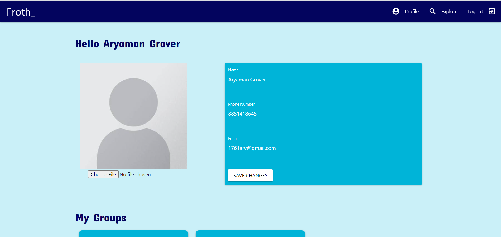
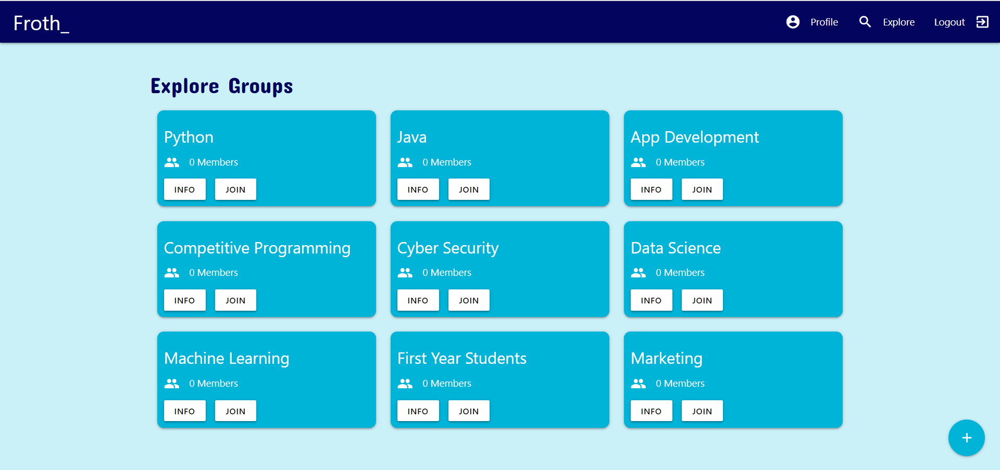
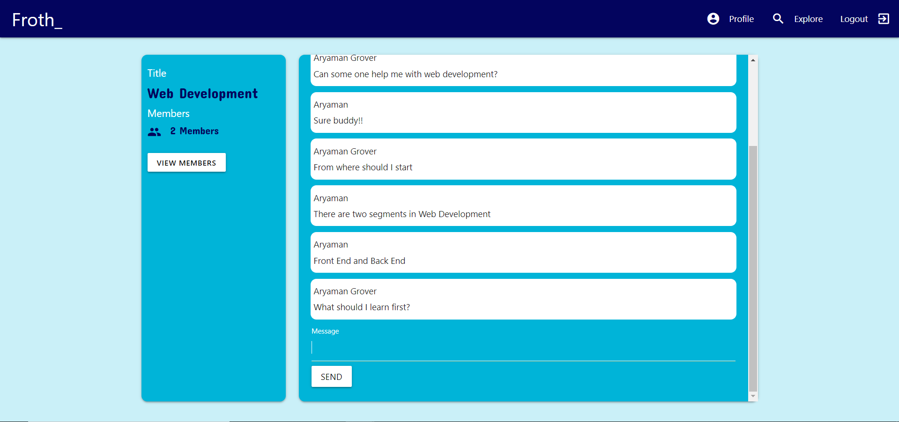

# Froth_ | Froums for your College
> I am currently working on the application to make it more optimized and user friendly.
## How to Run the application on your machine?
1. Clone the repository :- `git clone https://github.com/Aryaman1706/ReDoc.git`
2. Navigate to the folder via command line.
3. Install [npm packages](https://www.npmjs.com/) for the backend :- `npm i`
4. Navigate to the client folder :- `cd client`
5. Install [npm packages](https://www.npmjs.com/) for the frontend :- `npm i`
6. Go back to the root folder :- `cd ..`
7. Start the Application :- `npm run dev`
## Technical Specification
> MERN Stack

**Frontend**
* React application bootstraped by [create-react-app](https://create-react-app.dev/).
* [Redux](https://redux.js.org/) - For state management.
* CSS framework :- [Materialize CSS](https://materializecss.com/).
* [Socket.io -client](https://github.com/socketio/socket.io-client#readme) package used to provide RealTime chat functionality.

**Backend**
* [Node.js](https://nodejs.org/en/) - JavaScript runtime built.
* [Express.js](https://expressjs.com/) - Minimal [Node.js](https://nodejs.org/en/) web application framework.
* [MongoDB](https://www.mongodb.com/) - Database service.
* [Socket.io](https://socket.io/) - To provide RealTime functionality.
* [Passport](http://www.passportjs.org/) - To help with user authentication.

## Screen Shots of the Application

***

***

***

***

***

## Demo Video

